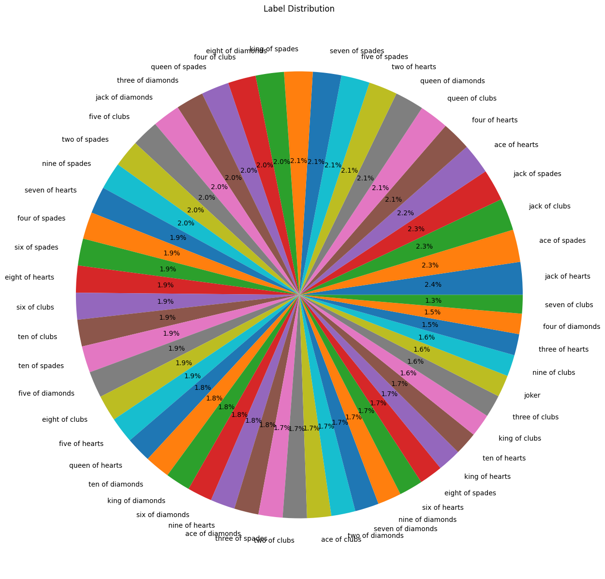

# Playing Cards Image Classification

## 🎯 Goal
The main purpose of this project is to **detect and classify between 53 different palying cards such as hearts , spades , diamonds etc.** from the dataset (mentioned below) using various image detection/recognition models and comparing their accuracy.

## 🧵 Dataset

The link to the dataset is given below :-

**Link :- https://www.kaggle.com/datasets/gpiosenka/cards-image-datasetclassification**

## 🧾 Description

This project involves the comparative analysis of **Five** Keras image detection models, namely **MobileNetV2** , **ResNet50V2** , **InceptionV3** , **DenseNet121** and **Xception**  applied to a specific dataset. The dataset consists of annotated images related to a particular domain, and the objectives include training and evaluating these models to compare their accuracy scores and performance metrics. Additionally, exploratory data analysis (EDA) techniques are employed to understand the dataset's characteristics, explore class distributions, detect imbalances, and identify areas for potential improvement. The methodology encompasses data preparation, model training, evaluation, comparative analysis of accuracy and performance metrics, and visualization of EDA insights. 

## 🧮 What I had done!

### 1. Data Loading and Preparation:
    Loaded the dataset containing image paths and corresponding labels into a pandas DataFrame for easy manipulation and analysis.

### 2. Exploratory Data Analysis (EDA):
    Bar Chart for Label Distribution: Created a bar chart to visualize the frequency distribution of different labels in the dataset.

    Pie Chart for Label Distribution: Generated a pie chart to represent the proportion of each label in the dataset.

### 3. Data Analysis:
    Counted the number of unique image paths to ensure data uniqueness and quality.
        Analyzed the distribution of image paths by label for the top 20 most frequent paths.
        Displayed the number of unique values for each categorical column to understand data variety.
        Visualized missing values in the dataset using a heatmap to identify and address potential data quality issues.
        Summarized and printed the counts of each label.

### 4. Image Preprocessing and Model Training:
    Loaded and preprocessed the test images, ensuring normalization of pixel values for consistency.
        Iterated through multiple models (VGG16, ResNet50 , Xception) saved in a directory and made predictions on the test dataset.
        Saved the predictions to CSV files for further analysis and comparison.

### 5. Model Prediction Visualization:
    Loaded models and visualized their predictions on a sample set of test images to qualitatively assess model performance.
        Adjusted image preprocessing for models requiring specific input sizes (e.g., 299x299 for Xception).

## 🚀 Models Implemented

Trained the dataset on various models , each of their summary is as follows :-

### Xception

When implementing the Xception model in code, we leverage its sophisticated architecture to bolster our image classification tasks. By loading the pre-trained Xception model with weights from the ImageNet dataset, we harness its comprehensive knowledge.

**Reasons for choosing Xception:** :  Lightweight (88 MB) , 
**Excellent Accuracy** (Xception achieves high accuracy in image classification tasks .) , 
Reduced Parameters (22.9M) ,
Faster Inference Speed (CPU - 39.4, GPU - 5.2)

Visualization of Predicted Labels on test set :-  

 

 

 

 

### MobileNetV2

Incorporating the MobileNetV2 model into our codebase brings a wealth of advantages to our image processing workflows. By initializing the pre-trained MobileNetV2 model with weights from the ImageNet dataset, we tap into its profound understanding of visual data.

**Reasons for selecting MobileNetV2:**

- Lightweight Architecture (MobileNetV2's efficient design allows for quick processing with minimal computational resources.)
- Proven Accuracy (MobileNetV2 consistently performs well in various image recognition benchmarks, balancing accuracy and speed.)
- Reduced Parameters (3.4M, significantly fewer than many other models, enabling faster inference and reduced memory usage.)
- High Efficiency (CPU - 5, GPU - 1.4, making it highly suitable for deployment on resource-constrained devices.)

Visualization of Predicted Labels on test set :-  

 

 

 

 

### ResNet50V2

Implementing transfer learning with the ResNet50V2 model allows us to benefit from pre-trained weights, significantly reducing the training duration necessary for image classification tasks. This strategy is particularly advantageous when dealing with limited training data, as we can leverage the comprehensive representations learned by the base model from extensive datasets like ImageNet.

**Reasons for opting for ResNet50V2:** Relatively lightweight (98 MB) , High Accuracy (92.1 % Top 5 accuracy), Moderate Parameters (25.6M) , Reasonable Inference Speed on GPU (CPU - 32.1, GPU - 4.7)

Visualization of Predicted Labels on test set :-  
 

 

 

 

### InceptionV3
When implementing the InceptionV3 model in code, we leverage its powerful architecture to enhance our image classification tasks. By loading the pre-trained InceptionV3 model with weights from the ImageNet dataset, we benefit from its extensive knowledge. 

**Reason for choosing :-** 
lightweighted (92 MB) , better accuracy , less parameters (23.9M) , less inference speed (CPU - 42.2 , GPU - 6.9)

Visualization of Predicted Labels on test set :-  
 

 

 

 

### DenseNet121

When implementing the DenseNet121 model in code, we leverage its densely connected architecture to enhance our image classification tasks. By loading the pre-trained DenseNet121 model with weights from the ImageNet dataset, we benefit from its extensive knowledge.

**Reason for choosing:** Lightweight (33 MB)
, High accuracy , Moderate number of parameters (8M) , Efficient inference speed (CPU - ~45 ms, GPU - ~10 ms).

Visualization of Predicted Labels on test set :-  

 

 

 

 

## 📚 Libraries Needed

1. **NumPy:** Fundamental package for numerical computing.
2. **pandas:** Data analysis and manipulation library.
3. **scikit-learn:** Machine learning library for classification, regression, and clustering.
4.  **Matplotlib:** Plotting library for creating visualizations.
5.  **Keras:** High-level neural networks API, typically used with TensorFlow backend.
6. **tqdm:** Progress bar utility for tracking iterations.
7. **seaborn:** Statistical data visualization library based on Matplotlib.

## 📊 Exploratory Data Analysis Results

### Bar Chart :-
 A bar chart showing the distribution of labels in the training dataset. It visually represents the frequency of each label category, providing an overview of how the labels are distributed across the dataset.

 

### Pie Chart :-
A pie chart illustrating the distribution of labels in the training dataset. The percentage value displayed on each segment indicates the relative frequency of each label category.

 

### Image paths distribution :-
 Visualizes the distribution of top 20 image paths by label, displays unique values in categorical columns.

 

## 📈 Performance of the Models based on the Accuracy Scores

| Models      |       Accuracy Scores|
|------------ |------------|
|Xception  |89% ( Validation Accuracy: 0.8942)|
|InceptionV3  | 84% (Validation Accuracy:0.8479) |
|DenseNet121     | 91% (Validation Accuracy:0.9125) |
|ResNet50V2  | 85% (Validation Accuracy:0.8492) |
|MobileNetV2   | 87% (Validation Accuracy: 0.8726) |

## 📢 Conclusion

**According to the accuracy scores it can be concluded that DenseNet121 and Xception  were able to perform good on this dataset.**

Even though all of  the models implemented above are giving above 80% accuracy which is great when it comes to image recognition.

## ✒️ Your Signature

Full name:-Aaradhya Singh                      
Github Id :- https://github.com/aaradhyasinghgaur  
Email ID :- aaradhyasinghgaur@gmail.com  
LinkdIn :- https://www.linkedin.com/in/aaradhya-singh-0b1927250/  
Participant Role :- Contributor / GSSOC (Girl Script Summer of Code ) - 2024